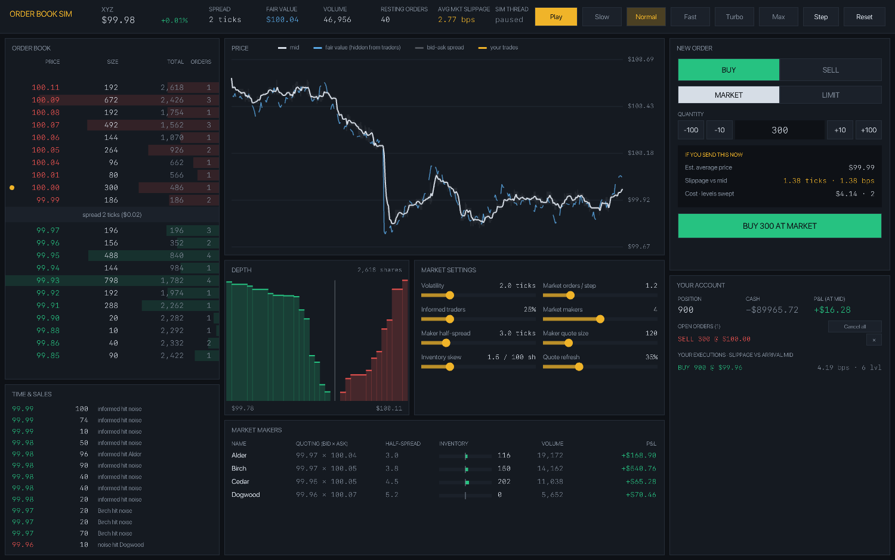

# Order Book Sim

A limit order book and matching engine in C++20, with simulated market makers, informed and noise traders, slippage measured on every fill, and a live GUI where you can trade against the market yourself.



- **Matching engine:** price-time priority, limit and market orders, cancels, self-trade prevention. About 6.6 million order messages per second on one thread.
- **Market makers:** quote both sides around a reference price, lean their quotes against their inventory, and get picked off when their quotes go stale.
- **Slippage:** every execution reports its average price against the mid and the best price at arrival, in ticks, basis points and dollars. The GUI shows a live estimate before you send.
- **Multithreading:** the market runs on its own thread so it isn't tied to the frame rate, and a benchmark runs thousands of independent simulations across all CPU cores (6.1× faster on 10 cores).

## Build and run

Needs CMake 3.20+, a C++20 compiler and [raylib](https://www.raylib.com) for the GUI.

```bash
brew install cmake raylib
cmake -S . -B build -DCMAKE_PREFIX_PATH=/opt/homebrew
cmake --build build -j
./build/orderbook_gui      # the GUI
./build/orderbook_tests    # matching engine tests
./build/orderbook_bench    # throughput + parallel slippage study
```

The engine (`src/OrderBook.cpp`, `src/Simulation.cpp`) has no dependencies. Without raylib, CMake skips the GUI and still builds the tests and benchmark.

### Using the GUI

| | |
|---|---|
| **Order book** (left) | Asks in red above the spread, bids in green below. Bars show size per level. A yellow dot marks your own orders. Click any row to use that price as your limit. |
| **New order** (right) | Pick buy or sell, market or limit, and a size. The box under it walks the current book and shows the average price, slippage and levels you would hit before you send. **Enter** submits. |
| **Price** | Mid price, the hidden fair value the market is chasing, the bid-ask band, and your trades. |
| **Depth** | Cumulative size on each side. Steep walls mean you can trade size cheaply; thin books mean slippage. |
| **Market settings** | Volatility, order flow, the share of informed traders, and the number, spread, size, skew and refresh rate of market makers. Try removing all the makers and watch the spread blow out. |
| **Header** | Play/pause (**Space**), speed from Slow (4 steps/s) to Max (as fast as the sim thread can go), single step and reset. |

## How matching works

`OrderBook` keeps one side per price direction:

```cpp
std::map<Price, std::list<Order>, std::greater<Price>> bids_;  // best (highest) bid first
std::map<Price, std::list<Order>, std::less<Price>>    asks_;  // best (lowest) ask first
std::unordered_map<OrderId, Location>                   index_; // id -> side, price, list iterator
```

- **Prices are integer ticks** (1 tick = $0.01), so matching never compares floating-point numbers.
- **Each price level is a FIFO queue.** `std::list` keeps iterators valid when other orders leave, which is what makes O(1) cancels possible.
- **`index_`** maps an order id straight to its list node, so `cancel(id)` doesn't search the book.

When an order arrives (`OrderBook::submit`):

1. **Record the arrival state.** The mid and the best opposite price are saved for the slippage report.
2. **Match against the opposite side, best price first.** At each level, fill the oldest order first (time priority). Each match trades `min(incoming remaining, resting remaining)` at the **resting** order's price. The maker set that price, so the taker gets it, even if the taker's limit was better.
3. **Stop** when the incoming order is filled, the next level is outside its limit price, or the book is empty.
4. **Leftovers:** a limit order rests at its price, at the back of that level's queue. A market order never rests; anything left is reported as `unfilled`.
5. **Self-trade prevention:** if the incoming order would hit a resting order from the same trader, the resting order is cancelled instead. Market makers quote both sides, so without this they could trade with themselves.

| Operation | Cost |
|---|---|
| Add a resting order | O(log P), P = number of price levels |
| Cancel by id | O(1) to find, O(log P) only if its level becomes empty |
| Best bid / best ask | O(1) |
| Match | O(log P) per level crossed + O(1) per fill |

### Slippage

Every `ExecutionReport` carries the arrival mid, the arrival touch (best opposite price) and the volume-weighted average fill price. Slippage is signed so that **positive always means worse for the trader**, for buys and sells alike:

```
direction      = +1 for a buy, -1 for a sell
vs mid (ticks) = direction × (average price − arrival mid)
vs touch       = direction × (average price − arrival best price)
basis points   = vs mid / arrival mid × 10,000
dollar cost    = vs mid × tick size × shares filled
```

"vs mid" includes paying half the spread. "vs touch" is pure book-walking: how much worse than the best price you did because your order was bigger than the first level.

`estimateMarket(side, quantity)` runs the same walk without changing the book. That's what powers the pre-trade estimate in the GUI.

## How the market makers work

Each `MarketMaker` (`src/Simulation.cpp`) does this every step:

1. **Maybe refresh.** With probability `refreshChance` (35% by default), it cancels its quotes and posts new ones. Otherwise it leaves its old quotes up, even if the price has moved. Those stale quotes are what informed traders pick off, so this is the source of **adverse selection**, the main risk of market making.
2. **Estimate a reference price.** Makers don't see the true fair value. Each one blends a noisy read of it (σ = 1.5 ticks) with the current book mid: `reference = 0.6 × noisy fair + 0.4 × mid`.
3. **Skew for inventory.** A maker that's long wants to sell and stop buying, so it shifts both quotes down:
   ```
   skew = skewTicksPer100 × position / 100
   bid  = floor(reference − halfSpread − skew)
   ask  = ceil (reference + halfSpread − skew)
   ```
   Getting hit on the bid makes it longer, which lowers its prices, which makes its ask more attractive. That's how it works its inventory back toward zero.
4. **Quote several levels.** It posts `levels` quotes per side, `levelSpacing` ticks apart, with more size deeper in the book. That deeper size is what makes big orders' slippage grow gradually instead of falling off a cliff.
5. **Respect inventory limits.** Past `maxInventory` shares long it stops bidding, and past that many short it stops offering.

Each maker gets a slightly wider spread and different size, so they compete on price. They act in a random order each step so none of them always gets to the book first.

### The rest of the market

- **Fair value** follows a random walk (volatility in ticks per step) with occasional news jumps.
- **Noise traders** send market orders on a random side (Poisson arrivals, exponential sizes). They pay the spread and lose money on average.
- **Informed traders** compare the true fair value with the mid and, when the gap is more than 5 ticks, buy or sell toward it. They make money, mostly from stale maker quotes.
- **Passive traders** place limit orders a few ticks from the mid, and old ones are cancelled.

Over a 10,000-step run with the defaults, the makers end up profitable, noise traders lose, informed traders win, and the mid stays within about 4 ticks of fair value on average. The test suite also checks that shares are conserved: every share bought was sold by someone.

## Multithreading: what runs in parallel, and what deliberately doesn't

**The matching engine is single-threaded on purpose.** Real exchanges process each instrument's orders in one strict sequence, because the result depends on order of arrival: time priority means the first order at a price gets filled first. Locking the book from several threads would make the result depend on which thread won the race, and the lock traffic would be slower than one core running through a hot, cache-friendly loop. One thread already does about 6.6 million messages per second here. Exchanges scale by **sharding instead**: each instrument gets its own engine on its own core.

What is parallel:

### 1. The simulation runs on its own thread

In the GUI (`src/gui/main.cpp`), a worker thread (`simLoop`) advances the market while the main thread draws:

```
sim thread:   [lock: run a batch of steps] sleep [lock: batch] sleep ...
GUI thread:            [lock: read book + queue draw calls] unlock → swap buffers (waits for vsync)
```

- **One `std::mutex`** guards the `Simulation`. The sim thread holds it only for a short batch (at most 200 steps), then sleeps briefly so the GUI can always get in.
- **The GUI holds the lock only while it reads** the market and queues draw calls. The buffer swap, which blocks for up to 16 ms waiting for the display, happens after `unlock()`.
- **Speed settings, play/pause and the measured steps per second** are `std::atomic`, so they're read and written without the lock.

The result: the market isn't capped at the 60 fps frame rate. In **Max** mode the sim thread runs thousands of steps per second (shown in the header as "SIM THREAD") while the screen still updates smoothly.

### 2. Parallel Monte Carlo slippage study

`bench/bench.cpp` asks: how much slippage does a market buy pay as it gets bigger? To get a stable answer it runs **900 independent simulations**: 150 random markets for each of 6 order sizes. Each trial builds its own `Simulation`, warms it up for 300 steps, sends one market order and records the slippage.

The trials share nothing, so they're embarrassingly parallel. A pool of `std::thread`s pulls trial indices from one `std::atomic<size_t>` counter, and each thread writes only its own trial's result, so no locks are needed:

```cpp
std::atomic<std::size_t> next{0};
auto work = [&] { for (auto i = next++; i < trials.size(); i = next++) runTrial(trials[i]); };
```

Each trial is seeded, so the benchmark runs the study on 1 thread and on N threads and checks that the answers are identical.

Measured on a 10-core Apple Silicon Mac:

```
Matching engine, 1 thread
  2,000,000 messages in 0.30 s  ->  6.64 million messages/s

Slippage study: 150 independent simulations per order size, 6 sizes
  1 thread:   1.06 s
  10 threads: 0.18 s  ->  6.1x faster  (identical results)

  order size      avg bps      p95 bps     avg levels
  100                2.17         4.16            1.6
  250                2.94         4.69            2.5
  500                3.52         5.43            3.4
  1000               4.70         6.54            4.9
  2000               6.47         8.84            8.1
  4000               7.76        10.21           11.9
```

The speedup is below 10× partly because Apple Silicon mixes fast performance cores with slower efficiency cores, and partly because starting threads and waiting for the last trial to finish isn't free on a run this short. More trials per size (`./build/orderbook_bench 1000`) gets closer to the core count.

### Where to go next

- **Shard by symbol:** one engine thread per instrument, fed by a lock-free single-producer/single-consumer queue.
- **Replace the GUI mutex with snapshots:** the sim thread publishes an immutable copy of the book each frame, so neither thread ever waits.
- **Swap `std::map` + `std::list` for flat arrays indexed by price** with pooled order nodes. That's the usual next step for a faster engine, since it avoids pointer chasing and allocation.

## Project layout

```
include/orderbook/Types.hpp       orders, fills, execution reports, slippage math
include/orderbook/OrderBook.hpp   the matching engine
include/orderbook/Simulation.hpp  market makers, other traders, accounts
src/OrderBook.cpp
src/Simulation.cpp
src/gui/main.cpp                  raylib GUI + simulation thread
bench/bench.cpp                   engine throughput + parallel slippage study
tests/test_orderbook.cpp          matching engine tests
```
